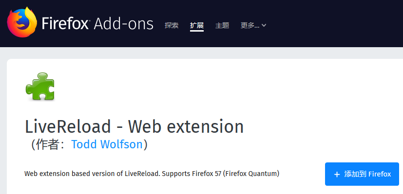
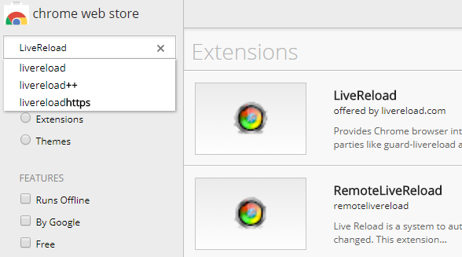
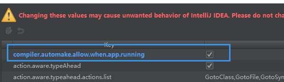
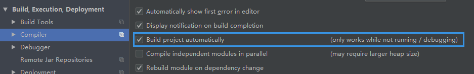

# Spring-Boot-Devtools 介绍与使用
> version: spring boot 2.0.3GA  

> 参考自：https://howtodoinjava.com/spring/spring-boot2/developer-tools-module-tutorial/  
https://docs.spring.io/spring-boot/docs/2.0.3.RELEASE/reference/htmlsingle/#using-boot-devtools  
在application.yml配置文件中能找到开发工具的配置
  
如果你使用过Node、Angular、Gulp等前端框架，你会发现当你的代码发生变动后，浏览器会自动重载UI(Auto-refresh/Auto-reload)，
这种特性能能帮助我们节约很多时间。  
Spring Boot 提供的开发工具，就是为了节省开发时间，提高开发效率。  
>Auto-refresh VS Auto-restart  
自动刷新是让浏览器重新加载静态资源，自动重启是为了使服务端更新的代码或者配置生效。

## 启用开发者工具
只需要加入`spring-boot-devtools`依赖即可。  
```xml
<dependencies>
    <dependency>
        <groupId>org.springframework.boot</groupId>
        <artifactId>spring-boot-devtools</artifactId>
        <optional>true</optional>
    </dependency>
</dependencies>
```  

## 静态资源缓存
为了改善性能，开发工具能缓存静态内容/模板，以便更加快速的提供给浏览器使用。  
这对线上环境是个很不错的特性，因为每一毫秒的性能提升都很重要。  
但是对于开发环境来说，很容易导致缓存问题，既改变代码后，页面没有及时刷新。  
开发工具提供了很方便的属性去设置缓存还是不缓存，默认的是不缓存。  
流行的模板框架基本都支持这个特性，如下所示：    
```
#application.properties
#spring.freemarker.cache = true //在线上环境设置为开启缓存，能提升性能
spring.freemarker.cache = false //在开发环境设置为不缓存，默认就是false
 
//Other such properties
 
spring.thymeleaf.cache = false
spring.mustache.cache = false
spring.groovy.template.cache = false
```  

## 自动刷新UI(Auto-reload)
开发工具包含一个嵌入式`LiveReload`服务器，当资源发生更改时，该服务器可用于触发浏览器刷新，前提条件是浏览器要支持它的[插件](https://github.com/livereload/livereload-extensions)。  
同样，也提供了`spring.devtools.livereload.enabled`属性去设置这个特性，它默认是开启的。  

### 浏览器插件的安装和使用
在firefox或chrome商店中搜索LiveReload即可。  
  
  

### 自动重载的路径
默认的，以下路径发生改变会触发自动重载（classpath就是IDEA中的resources文件夹）：  
- /META-INF/maven
- /META-INF/resources
- /resources
- /static
- /public
- /templates  
  
如果不想classpath中的某些路径触发自动重载，可以设置排除名单：  
```
spring.devtools.restart.exclude=static/**,public/**
```  
如果希望某些不在classpath中的路径，也能触发自动重载，可以这样设置：  
```
spring.devtools.restart.additional-paths=script/**
```  
当然也能设置额外路径的排除名单：  
```
spring.devtools.restart.additional-exclude=styles/**
```  

## 服务器自动重启（Auto-restart）
> 自动重启的目的是重新加载服务器端的java class文件和配置文件。  

### 重启日志
默认的，每当触发重启时，会打印出一些日志，它记录了一些更改，如添加删除了bean。  
若不想看这些日志，可以将这个特性关闭：  
```
spring.devtools.restart.log-condition-evaluation-delta = false
```  

### 禁止重启
```
spring.devtools.restart.enabled = false
```  

### 使用文件触发器
默认的，每次文件改变都会触发自动重启，但是过于频繁的重启，有时会减慢开发效率。  
为了避免这个问题，我们可以将某个文件设置为触发器。  
spring boot会持续监视我们的触发器文件，一旦它发生更改，就会触发自动重启。  
```
spring.devtools.restart.trigger-file = c:/workspace/restart-trigger.txt
```

## 全局配置文件
开发工具的全局配置文件是 `.spring-boot-devtools.properties`，注意它以“.”开头。  
若把这个文件放在系统的用户目录（win是C:\Users\userName Linux是/home/userName）下，则所有使用开发工具的spring boot项目都可以读取这个文件。  

## 在IDEA中的额外设置
1. 按快捷键`Ctrl + Shift + Alt + /`，然后选择Registry，将此项打勾：  
  
2. 按快捷键`Ctrl + Alt + S`进入`compiler`设置，然后勾选自动build：  
  

3. 重启IDEA，修改classpath中的文件并保存后，将会看到项目快速重启，并打印日志。